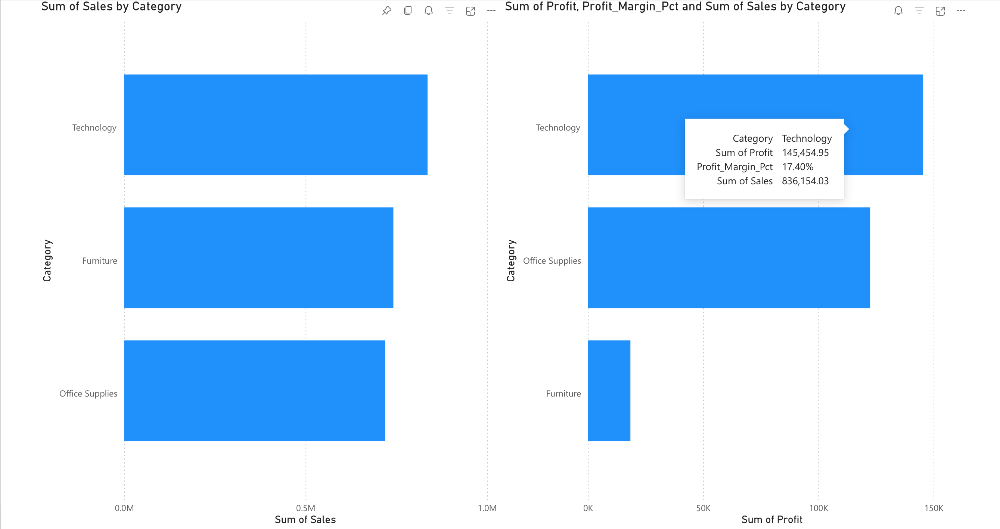

# Product Performance Intelligence System

## Executive Summary
This project is a multi-stage Business Intelligence (BI) pipeline designed to 
transform raw retail data into actionable strategic insights. By leveraging Python 
for deep-dive analysis and preparing data for Power BI visualization, this system 
identifies profit-leakage areas and highlights high-growth market segments.

## Technical Implementation (The Python Layer)

*   **Data Preprocessing**: Handled missing values and standardized currency 
formats using `Pandas`.
*   **Temporal Analysis**: Converted raw strings into `datetime` objects to 
analyze monthly revenue trends and seasonality.
*   **Statistical Visualization**: Utilized `Seaborn` and `Matplotlib` to create 
correlation plots between discount rates and net profit margins.
*   **Data Export**: Engineered a clean, structured CSV output 
(`cleaned_superstore.csv`) optimized for BI consumption.

## Business Insights (The Managerial Layer)

*   **Product Detractors**: Which sub-categories are currently operating at a 
loss?
*   **The Discount Trap**: At what percentage does discounting stop driving sales 
and start destroying profit?
*   **Market Share**: Which regions contribute the highest percentage of total 
revenue?

## Power BI Roadmap (Next Phase)

1.  **Direct Connection**: Linking the `cleaned_superstore.csv` to Power BI 
Desktop.
2.  **DAX Development**: Implementing Calculated Measures for Year-over-Year (YoY) 
growth and Rolling Averages.
3.  **Interactive UX**: Building a drill-down dashboard for regional managers to 
track performance in real-time.

##  How to View the Analysis
* **Interactive Dashboard**: [Download the Power BI File (.pbix)](https://github.com/Menna06/product-performance-intelligence/raw/main/PowerBI_Charts.pbix)
  
* ### Option 1: Quick View (No Installation Required) 
For a fast overview of the insights and visualizations:
*   Simply click on the **[Product Performance Intelligence 
System.ipynb](Product%20Performance%20Intelligence%20System.ipynb)** file here in 
the GitHub file list.
*   GitHub will automatically render the notebook, showing all code, professional 
comments, and generated charts (Revenue trends, Discount traps, and Segment 
analysis).

### Option 2: Local Execution (For Technical Review)
To interact with the code or test the data processing logic:
1.  **Clone the Repo**: `git clone 
https://github.com/Menna06/product-performance-intelligence.git`
2.  **Navigate & Launch**: Open your terminal in the project folder and run 
`jupyter lab`.
3.  **Run All**: Open the notebook and select `Run` -> `Run All Cells`.

## Author
**Menna Tarek**  
# 
product-performance-intelligence
A data analytics system for evaluating product performance, profitability, and business insights
